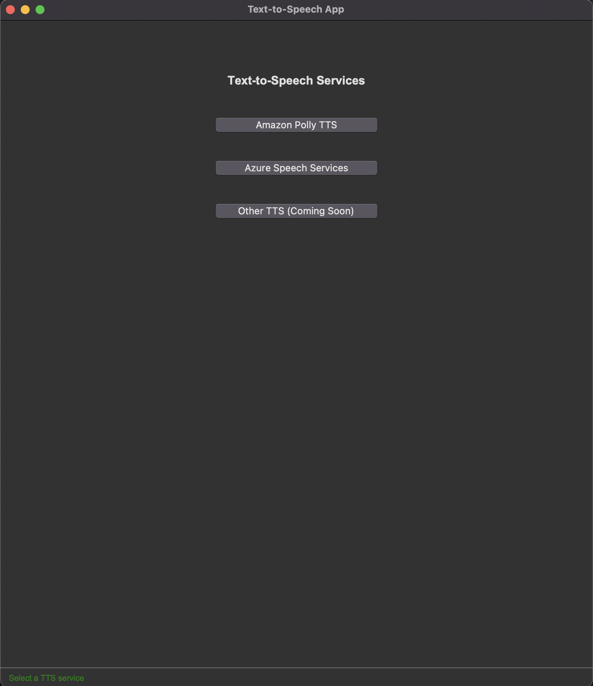
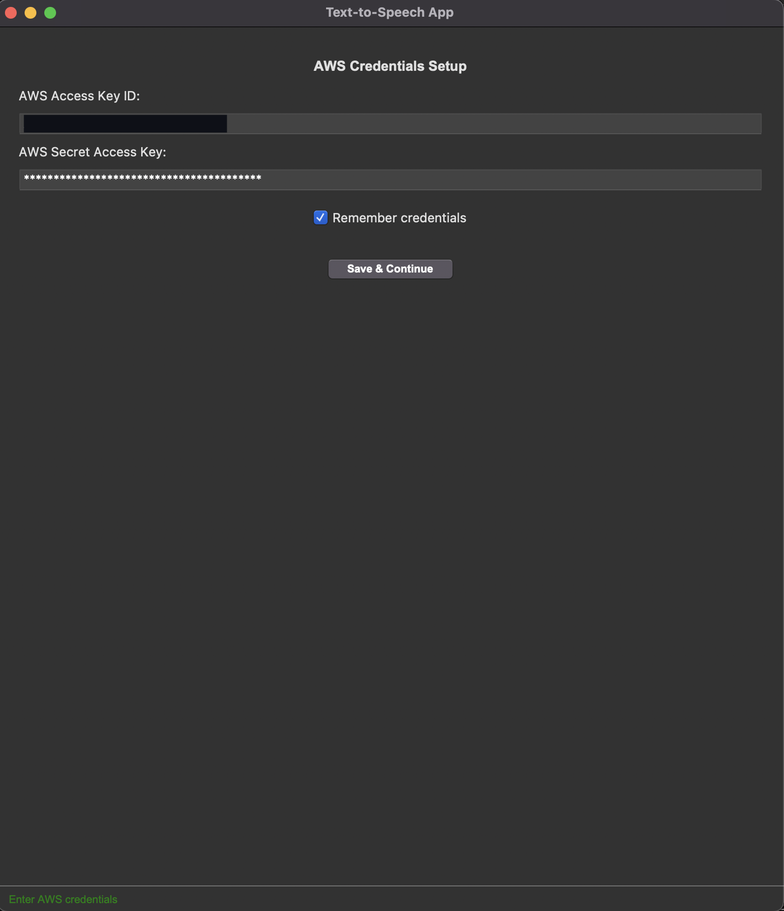
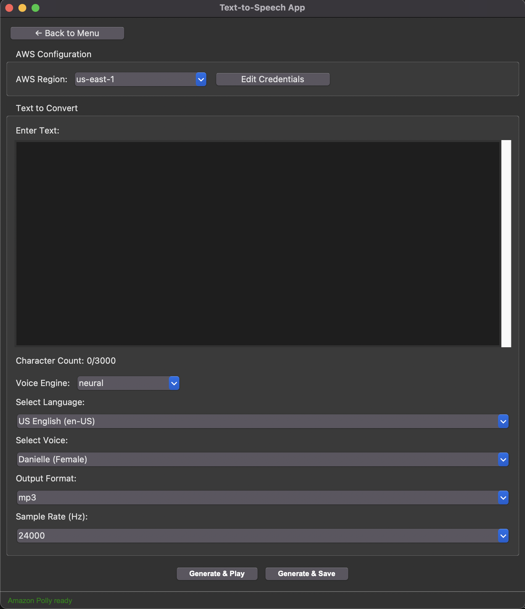
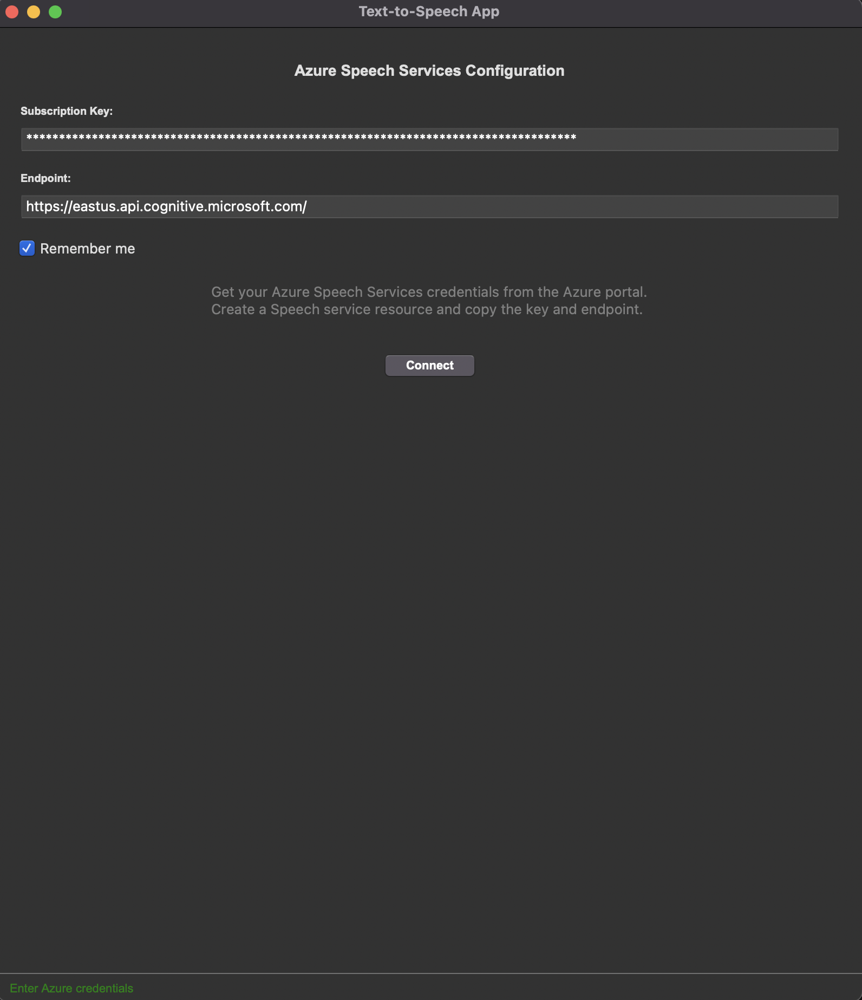
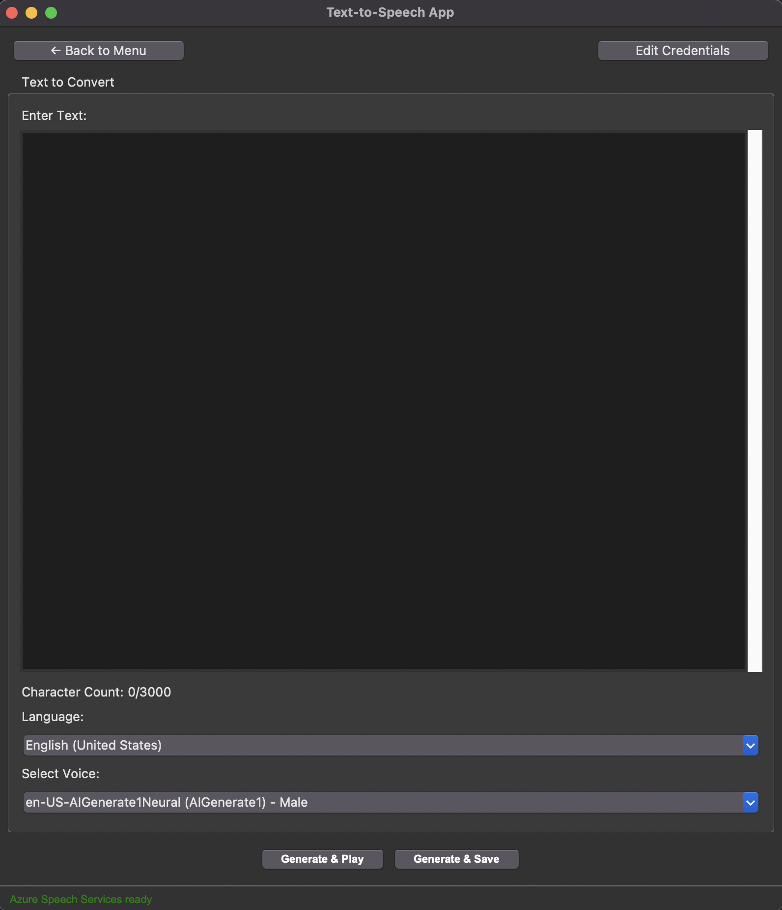

# Python TTS (Text-to-Speech) App

A comprehensive Python Text-to-Speech application supporting multiple TTS services. Choose between Amazon Polly and Microsoft Azure Speech Services for high-quality text-to-speech conversion.

 

## Features

### Core Features

- **Multi-Service Support**: Choose between Amazon Polly and Microsoft Azure Speech Services
- **Secure Credential Management**: Encrypted storage using system keyring
- **Flexible Output Options**:
  - Instant playback ("Generate & Play")
  - Save to Downloads folder ("Generate & Save")

### Amazon Polly Features

- Convert text to speech using AWS Polly
- Region selection with automatic engine detection
- Real-time character counting (3000 char limit)
- Support for multiple voice engines (Standard, Neural, Long-form, Generative)
- Multiple language and voice selection
- Multiple output formats (mp3, ogg_vorbis, pcm)
- Multiple sample rate
- Save and edit AWS credentials

### Microsoft Azure Features

- Convert text to speech using Azure Cognitive Services
- High-quality neural voices
- Real-time character counting (3000 char limit)
- Multiple language and voice selection
- Save and edit Microsoft Azure credentials

## Setup Guide

### Installation

1. Go to Releases then to the latest release
2. Click on the .zip file to download it
3. Double click on the zip file to open it
4. Double click on the TTSApp to open the app

## Amazon Polly Setup

### 1. AWS Account Setup

#### Create AWS Account

1. Go to [AWS Homepage](https://aws.amazon.com/)
2. Click "Create Account"
3. Provide:
   - Email address
   - Password
   - Contact information
   - Credit card (for verification)

---

### 2. Configure IAM User

#### Access IAM Console

1. Log in to [AWS Management Console](https://console.aws.amazon.com/)
2. Search for "IAM" in the top search bar
3. Click on **IAM** under Services

#### Create New User

1. Under **Access management**, click **Users**
2. Click **Create user**
3. Enter a username (e.g., `tts-app-user`)
4. Click **Next**

#### Set Permissions

1. Under **Permission options**, select:
   - ☑ **Attach policies directly**
2. Search for `AmazonPollyFullAccess`
3. Check the policy box
4. Click **Next** → **Create user**

---

### 3. Get Security Credentials

1. In the **Users** list, click your new user
2. Go to **Security credentials** tab
3. Under **Access keys**, click **Create access key**
4. Select:
   - ☑ **Application running outside AWS**
5. Click **Next**
6. (Optional) Add description
7. Click **Create access key**

#### Save Credentials

1. Click **Download .csv file**
2. Store the .csv file securely which contains your:
   - `AWS Access key ID`
   - `AWS Secret access key`

## Microsoft Azure Speech Services Setup

### 1. Azure Account Setup

#### Create Azure Account

1. Go to [Azure Portal](https://portal.azure.com/)
2. Click "Start free" or "Sign in"
3. Create a new Microsoft account or use existing one
4. Provide required information and verification

---

### 2. Create Speech Service Resource

#### Access Azure Portal

1. Log in to [Azure Portal](https://portal.azure.com/)
2. Click **"Create a resource"** (+ icon)
3. Search for **"Speech"**
4. Click **"Speech"** by Microsoft

#### Configure Speech Service

1. Fill in the required fields:
   - **Subscription**: Choose your subscription
   - **Resource Group**: Create new or use existing
   - **Region**: Choose a region (e.g., East US)
   - **Name**: Enter a unique name for your speech service
   - **Pricing Tier**: Choose appropriate tier (F0 for free tier)
2. Click **"Review + create"**
3. Click **"Create"**

---

### 3. Get Service Credentials

1. After deployment, go to your Speech service resource
2. In the left menu, click **"Keys and Endpoint"**
3. Copy the following values:
   - **Key 1** (Subscription Key)
   - **Endpoint URL**

## User Guide

### Getting Started

 

1. Launch the application
2. Choose your preferred TTS service:
   - **Amazon Polly TTS** - AWS-powered speech synthesis
   - **Microsoft Azure TTS** - Azure Speech Services

## Using Amazon Polly TTS

### 1. Credential Configuration

 

- In the "AWS Credentials Setup" section, enter credentials from your downloaded .csv file:
  - AWS Access Key ID (from your downloaded .csv)
  - AWS Secret Access Key (from your downloaded .csv)
- Enable ☑ **Remember credentials** for automatic login
- Click **"Save & Continue"**

---

### 2. Text-to-Speech with Polly

 

1. **Select Region**: Choose AWS region from dropdown (Recommended: us-east-1)
2. **Enter Text**: Type or paste your text into the text box (character count displayed)
3. **Configure Voice Settings**:
    - Voice Engine (Standard, Neural, Long-form, Generative)
    - Language
    - Voice
4. **Audio Settings** (for "Generate & Save"):
    - Output Format (MP3, OGG Vorbis, PCM)
    - Sample Rate
5. **Generate Audio**:
    - **"Generate & Play"**: Convert and play audio immediately
    - **"Generate & Save"**: Convert and save to Downloads folder

## Using Microsoft Azure TTS

### 1. Credential Configuration

 

- In the "Azure Speech Service Setup" section, enter your Azure credentials:
  - **Subscription Key** (Key 1 from Azure portal)
  - **Endpoint URL** (from Azure portal)
- Enable ☑ **Remember credentials** for automatic login
- Click **"Save & Continue"**

---

### 2. Text-to-Speech with Azure

 

1. **Enter Text**: Type or paste your text into the text box (character count displayed)
2. **Configure Voice Settings**:
    - Language
    - Voice
3. **Generate Audio**:
    - **"Generate & Play"**: Convert and play audio immediately
    - **"Generate & Save"**: Convert and save to Downloads folder

## Project Roadmap

- Usage tracking and free character count monitoring
- AI-powered text refinement (typo correction, grammar improvement)
- Enhance error handling
