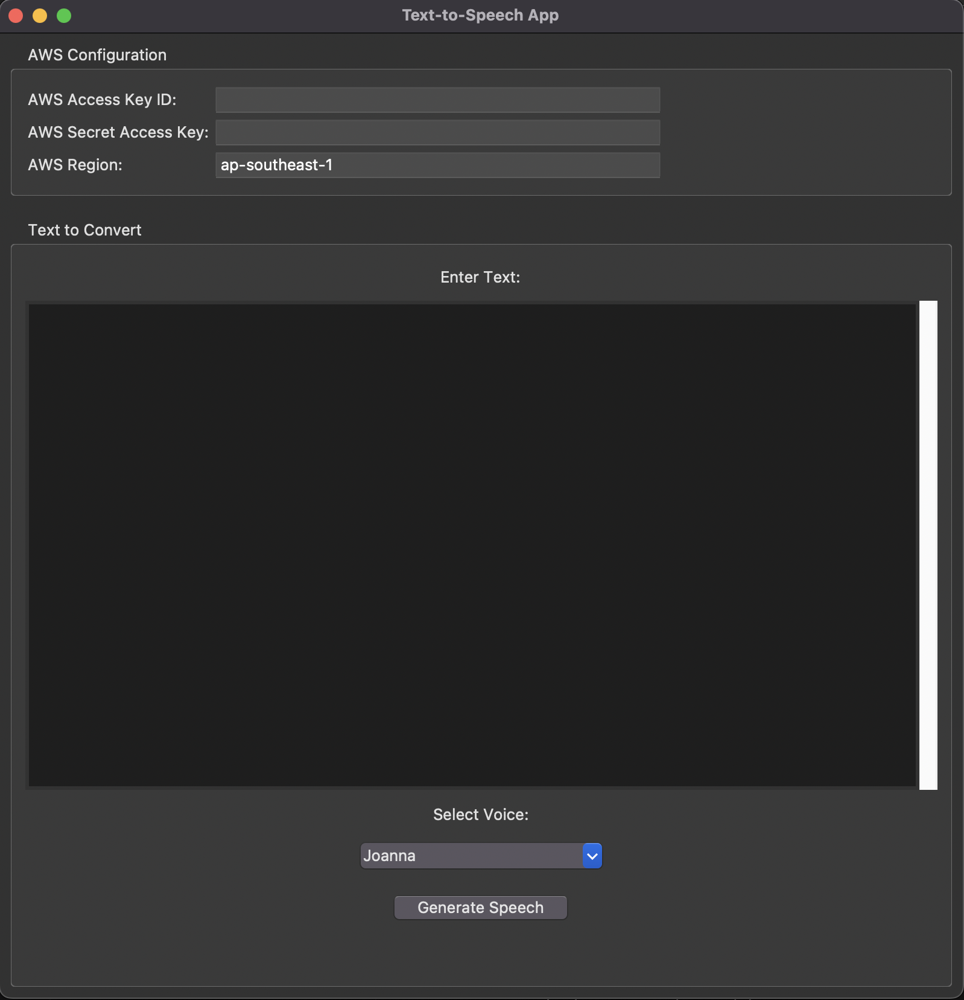

# Python TTS (Text-to-Speech) App
A Python Text-to-Speech App using Amazon Polly TTS Service. This app takes text from the user and generates audio for it.

 

## Features
- Convert text to speech using AWS Polly
- Region selection with automatic engine detection
- Real-time character counting (3000 char limit)
- Support for multiple voice engines (Standard, Neural, Long-form, Generative)
- Multiple language and voice selection
- Multiple output formats (mp3, ogg_vorbis, pcm)
- Multiple sample rate
- Audio Generation Options:
    - Instant playback ("Generate & Play")
    - Save to Downloads folder ("Generate & Save")
- Save and edit AWS credentials 

## Setup Guide

### 1. AWS Account Setup

#### Create AWS Account
1. Go to [AWS Homepage](https://aws.amazon.com/)
2. Click "Create Account"
3. Provide:
   - Email address
   - Password
   - Contact information
   - Credit card (for verification)

---

### 2. Configure IAM User

#### Access IAM Console
1. Log in to [AWS Management Console](https://console.aws.amazon.com/)
2. Search for "IAM" in the top search bar
3. Click on **IAM** under Services

#### Create New User
1. Under **Access management**, click **Users**
2. Click **Create user**
3. Enter a username (e.g., `tts-app-user`)
4. Click **Next**

#### Set Permissions
1. Under **Permission options**, select:
   - ☑ **Attach policies directly**
2. Search for `AmazonPollyFullAccess`
3. Check the policy box
4. Click **Next** → **Create user**

---

### 3. Get Security Credentials

1. In the **Users** list, click your new user
2. Go to **Security credentials** tab
3. Under **Access keys**, click **Create access key**
4. Select:
   - ☑ **Application running outside AWS**
5. Click **Next**
6. (Optional) Add description
7. Click **Create access key**

#### Save Credentials
1. Click **Download .csv file**
2. Store the .csv file securely which contains your:
   - `AWS Access key ID`
   - `AWS Secret access key`

## App Installation
1. Go to Releases then to the latest release
2. Click on the .zip file to download it
3. Double click on the zip file to open it
4. Double click on the TTSApp to open the app

## User Guide for AWS Polly

### 1. Select Amazon Polly TTS

 
- Launch the application and select Amazon Polly TTS

---

### 2. Credential Configuration

 

- In the "AWS Credentials Setup" section, enter credentials from your downloaded .csv file:
    - AWS Access Key ID (from your downloaded .csv)
    - AWS Secret Access Key (from your downloaded .csv)
- Enable ☑ Remember credentials for automatic login
- Click **"Save & Continue"**

---

### 3. Text-to-Speech Conversion

 

1. Select AWS region from dropdown (Recommended: us-east-1)
2. Type or paste your text into the large text box. Character count available.
3. Select Configurations:
    - Voice Engine
    - Language
    - Voice
4. Audio Settings (for "Generate & Save")
    - Output Format
    - Sample Rate
5. Generate Audio:
    - Press "Generate & Play" to convert your text and play audio immediately
    - Press "Generate & Save" to convert your text and save audio file to your Downloads folder (The app will show the save path in the status message)

## Project Roadmap

- Transform app into an app that supports multiple TTS service
- Make the app available for Windows and Linux (x86 architecture)
- Add more features such as tracking free characters count remaining
- Usage of AI assistance to refine the text (e.g., fix typos, grammar errors, improve language)
